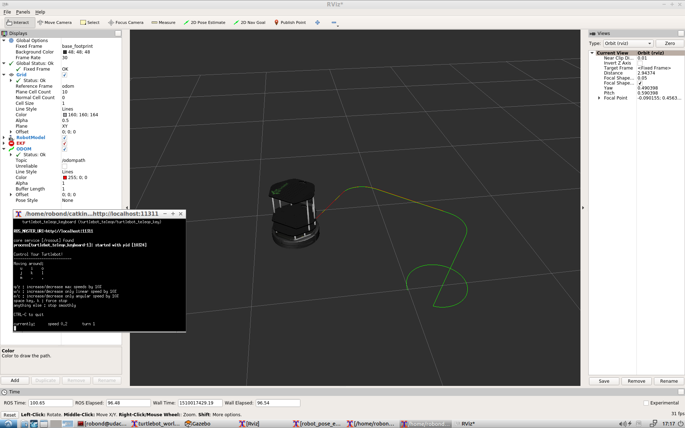

[](https://www.udacity.com/robotics)

# RoboND-EKFLab
In this lab, you will be applying an EKF ROS package to localize your robot inside a Gazebo environment. In the end, you will be able to drive the robot around in simulation and observe the `Odom` and `EKF` trajectories.   

### Steps to Launch the Simulation
Launch the simulation in the VM machine provided in Term1. 

#### Step 1 Create a Catkin Workspace
```sh
$ mkdir -p /home/workspace/catkin_ws/src
$ cd /home/workspace/catkin_ws/src
$ catkin_init_workspace
$ cd ..
$ catkin_make
```

#### Step 2 Perform a System Update/Upgrade
```sh
$ apt-get update
$ apt-get upgrade -y
```

#### Step 3 Clone the Package in src
```sh
$ cd /home/workspace/catkin_ws/src
$ git clone https://github.com/udacity/RoboND-EKFLab
```

#### Step 4 Edit the main.launch file
Under main/launch, edit the main.launch file:
```html
Delete this: <node pkg="rviz" type="rviz" name="rviz" args="-d /home/workspace/catkin_ws/src/EKFLab.rviz"/>
Replace with: <node pkg="rviz" type="rviz" name="rviz" args="-d /home/workspace/catkin_ws/src/RoboND-EKFLab/EKFLab.rviz"/>
```

#### Step 5 Install Packages Dependancies
```sh
$ cd /home/workspace/catkin_ws/
$ source devel/setup.bash
$ rosdep -i install turtlebot_gazebo
$ rosdep -i install turtlebot_teleop
```

#### Step 6 Build the Packages
```sh
$ catkin_make
$ source devel/setup.bash
```

#### Step 7 Launch the main file
```sh
$ roslaunch main main.launch
```
Now, you should see Gazebo and rviz launching. Please note that Gazebo might take up to 3 min to launch! 


### End Result
In the terminal, use the keyboard commands(u-i-o-j-k-l-m-,-.) and drive the robot around. The `red` trajectory represents the `Odom path` whereas the `green` trajectory represents the `EKF path`.





